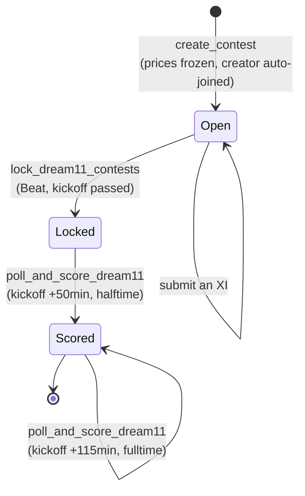

# Dream11 contests

A single-fixture contest mode, separate from the season-long FPL game that the
rest of this repo implements. You pick 11 players from the two clubs in **one
match**, spend a budget of **credits** (not £m), and score under **Dream11's own
point weightings** rather than FPL's.

Everything lives in its own Postgres schema (`dream11`), has its own scoring
module, and — on the frontend — its own navigation mode.

This document explains how the layers fit together and why the non-obvious
decisions were made. It is not an API reference: the Pydantic response models in
`backend/Game_logic/dream11.py` and the DDL in the migration are the field-level
source of truth, and duplicating them here would only create a second copy to go
stale.

---

## 1. Lifecycle



| Stage | What happens | Owner |
|---|---|---|
| Create | Player pool resolved, prices computed **once** and frozen, creator auto-joined, two scoring tasks scheduled | `dream11.py: create_contest` |
| Join | By 7-char invite code; blocked once locked or at capacity | `dream11.py: join_contest` |
| Submit | One XI per user per contest, validated in full | `dream11.py: submit_team` |
| Lock | `is_locked` flips at kickoff — gates joining *and* submitting | `dream11_locking.py: lock_started_contests` |
| Score | Points and ranks written to `contest_members` | `dream11_scoring.py` |

Locking is the hinge: before it, everyone picks blind; after it, picks are final
and opponents' teams become visible.

---

## 2. Database

Schema `dream11`, created in
`backend/Migrations/versions/1acbf07cfb53_add_dream11_schema_and_fixture_poll_.py`.

| Table | Holds |
|---|---|
| `contests` | One row per contest: fixture, name, invite code, `max_members`, `is_locked` |
| `contest_members` | Membership, plus each member's `total_points` and `rank` |
| `player_prices` | The frozen credit price of every pool player, per contest |
| `teams` | One submitted XI per user per contest (`uq_d11_teams_contest_user`) |
| `team_players` | The 11 rows of a team, with `is_captain` / `is_vice_captain` |

It reads from the shared `ml` schema — `players`, `teams`, `fixtures` for the
pool and fixture data, and `player_gw_stats` for both pricing inputs and match
results.

### Two triggers carry real invariants

- **`enforce_price_immutability`** (BEFORE UPDATE on `player_prices`) — prices
  are set once at creation and can never change, enforced at the database level
  rather than trusted to application code.
- **`enforce_contest_lock`** (BEFORE INSERT on **`teams`**, not `team_players`) —
  because the trigger fires on the parent row, inserting it first gates the whole
  submission before any player rows are attempted.

### The id convention trap

`player_prices.player_id` and `team_players.player_id` are foreign keys to
**`ml.players.id`** (the internal serial) — the *opposite* of
`squad_players` / `starting_xi` / `transfers` everywhere else in this project,
which use `fpl_id`.

The HTTP API still speaks `fpl_id` throughout, consistent with every other
endpoint; `dream11.py` resolves `fpl_id → ml.players.id` before any insert. If
you touch these tables directly, check which id you are holding.

---

## 3. Game logic

### Team rules — `dream11.py`

Validated in `_validate_team`, which collects **every** failure rather than
stopping at the first, so one round-trip tells the user everything that's wrong.

| Rule | Value |
|---|---|
| Squad size | exactly 11 |
| GK / DEF / MID / FWD | exactly 1 / 3–5 / 3–5 / 1–3 |
| Budget | ≤ 100.0 credits |
| Per club | ≤ 7 players from one side |
| Captain & vice | must differ, both must be in the XI |

### Pricing — `dream11.py: PRICE_INPUT_QUERY`, `_compute_prices`

The pool is **every** `ml.players` row for both clubs — the whole squad, not a
confirmed XI. Each player's price comes from the mean of their last ≤5 completed
gameweeks' `total_points`, min-max normalised *within that pool only* into
`[6.0, 11.0]`, rounded to the nearest 0.5.

Two deliberate edge cases: a player with no prior gameweeks is floored to 6.0 and
excluded from the min/max; and if fewer than two distinct values exist, **every**
player gets 6.0 — avoiding both a divide-by-zero and an arbitrary single winner.

> Pricing reads **`ml.player_gw_stats`**, not `ml.player_gw_features`. That table
> has zero rows and **no writer anywhere in the codebase** — the only inserts
> were in tests, which masked the gap. `feature_builder.py` abandoned it for the
> same reason. Don't point new code at it.

### Scoring — `dream11_scoring.py`

Goals are weighted by position (GK 10, DEF 6, MID 5, FWD 4); assists a flat 20
regardless of position; cards, own goals and penalties carry the usual
negatives; GK saves score per 3, and GK/DEF concede −1 per 2 goals against. The
constants live at module top so the weighting table is easy to find and adjust.

> Assists being worth more than any goal is real Dream11, not a typo — and it
> is the one weighting here that differs from FPL by more than a rounding
> (`Results/scoring.py` scores an assist at 3, which is the separate classic
> rule and must stay 3).

Two places it deliberately diverges from FPL — the reason this module exists
separately from `scoring.py`:

1. **Clean sheets use a 54-minute threshold**, recomputed from `goals_conceded`
   and `minutes`. The precomputed `clean_sheets` column is *never* read, because
   it bakes in FPL's 60-minute rule. Keeping them separate means the two
   definitions can never get crossed.
2. **Captain 2× and vice 1.5× are both unconditional and simultaneous**, applied
   as an additive bonus on top of a raw total that already counts everyone once:
   `final = raw + captain_pts × 1.0 + vice_pts × 0.5`. In FPL the vice is a
   *fallback* that only fires if the captain didn't play. Here both always apply,
   to two different players, and a captain who scored 0 simply contributes a 0
   bonus without affecting the vice.

Re-scoring is a plain `UPDATE` with a freshly recomputed value, so it is
naturally idempotent — a contest is scoped to one fixture, with no prior
gameweeks to accumulate.

---

## 4. API

Ten routes, all mounted in `backend/Context_assembler/main.py`.

**Reads** — `GET /fixtures` (match list with scores, contest counts and the
caller's per-fixture rank/points), plus `/dream11/contests`,
`/dream11/contests/{id}`, `/dream11/fixtures/{id}/contests`,
`/dream11/contests/{id}/players` (the priced pool),
`/dream11/contests/{id}/leaderboard`, and `/dream11/contests/{id}/team`.

**Writes** — `POST /dream11/contests`, `/dream11/contests/join`,
`/dream11/contests/{id}/team`.

### Conventions that matter more than the shapes

- **Writes return 422 with every failure collected** into one `detail` list.
- **Reads return 404** for a missing contest (matching `leagues.py`'s GET), while
  writes fold a bad `contest_id` into that same 422 list — there it is one
  validation failure among several, not a missing resource.
- **Contest summaries ship the rules**: `team_size`, `budget_cap`,
  `captain_multiplier`, `vice_captain_multiplier`, `max_players_per_club`. The UI
  renders its rule strip from these rather than hardcoding numbers that could
  drift from `dream11_scoring.py`.
- **`GET .../team` recomputes points live** via `calculate_dream11_points` rather
  than reading `contest_members.total_points`, so a team's per-player breakdown
  always sums to the total shown beside it. The stored checkpoint value comes
  back alongside as `contest_total_points`. That import is the only coupling
  between the two modules, and exists so the weightings have exactly one
  definition.

### The one authenticated endpoint

`GET /dream11/contests/{id}/team` is the **only endpoint in the project** that
requires a bearer token. Everywhere else `user_id` selects the caller's *own*
data, where spoofing it gains nothing. Here it selects *someone else's*, so:

- `user_id` names **whose** team to fetch;
- `current_user` (from the token) is **who is asking**, and cannot be spoofed.

Opponents' teams are readable only once the contest is **locked**, and only by a
**fellow member**. Without real authentication the lock check would be pure
decoration — a snooper would simply pass the victim's id as their own.

---

## 5. Frontend

| Route | Screen |
|---|---|
| `/matches` | Match list — Live / Upcoming / Completed |
| `/matches/:fixtureId` | Match detail — your contests, join by code, create |
| `/dream11` | Your contests |
| `/dream11/contests/:contestId` | Leaderboard, and entry point to any member's XI |
| `/dream11/contests/:contestId/pick` | The team builder |

API wrappers live in `frontend/src/api/dream11.js` and `api/fixtures.js`.

The builder mirrors every server rule client-side — squad shape, budget, captain
and vice, and the per-club cap — so an illegal team is unbuildable rather than
rejected after a round-trip. It reads the numbers from the contest summary
(`team_size`, `budget_cap`, `max_players_per_club`, the two multipliers) rather
than hardcoding them. The server re-checks everything regardless; the client copy
is for feedback, not trust, and has to track `_validate_team`.

### Mode, not just routes — `frontend/src/config/appMode.jsx`

The app runs in **FPL** or **Contests** mode. Mode swaps the `BottomNav` tab set
(five FPL destinations vs `Matches · My Contests · Chats`), is persisted to
`localStorage`, and is **derived from the path** so deep links self-correct — the
header can never claim FPL while a contest screen is on-screen. `AppModeProvider`
wraps the whole authenticated area rather than `Layout`, because Dashboard and
Squad Selection draw their own chrome outside it.

### Non-2xx responses as game states

`api/client.js` raises typed errors, and this is the key idea on the Dream11
screens: **403 and 404 are legitimate states, not failures.**

- **403** → "Teams are revealed at kickoff" (or you aren't a member)
- **404** → "This manager hasn't picked a team"

Both render as informational panels; neither gets an error toast. `ForbiddenError`
is deliberately distinct from `AuthError` so a 403 never triggers the 401 logout
path.

---

## 6. Automation

Requires **Redis**, a **Celery worker**, and **Beat** — all three:

```
celery -A Worker.celery_app worker --loglevel=info --pool=solo   # --pool=solo is required on Windows
celery -A Worker.celery_app beat   --loglevel=info
```

- **`lock_dream11_contests`** — Beat, every 300s. The **only** thing anywhere
  that sets `contests.is_locked = TRUE`.
- **`poll_and_score_dream11`** — two one-off tasks per contest, scheduled at
  creation for kickoff **+50min** (halftime) and **+115min** (fulltime).

**Without a worker and beat running, contests never lock** — so opponents' teams
stay hidden indefinitely and scoring never fires. Everything else in the app
still works.

### Scheduling is off the request path, deliberately

`create_contest` queues those tasks in a FastAPI `BackgroundTask`. Inline, with
Redis unreachable, the POST hung **~100 seconds** and then left the Celery app
poisoned for the entire process ("Retry limit exceeded … must be restarted").
The bounded retry policy in `Worker/celery_app.py` cut that to ~16s; moving it
off the request path made it 0s to the client. Both halves are load-bearing —
the retry policy now only bounds how long a background thread spends failing.

---

## 7. Known gaps

- **No team editing.** Submission is INSERT-only, one team per user per contest;
  resubmitting returns a 422.
- **No live match minute.** `ml.fixtures` stores no clock, so the match list
  shows a LIVE pill rather than a fabricated `68'`. FPL's fixtures endpoint does
  expose `minutes`, but surfacing it needs a column plus a frequent in-play poll.
- **Gameweek 1 prices are flat.** With no prior gameweek to roll over, every
  player floors to 6.0 and the credit budget cannot bind in the season's first
  round.
- **No public contest browsing.** Contests are code-join only, which is why
  `GET /dream11/fixtures/{id}/contests` returns only contests the caller has
  already joined. Browsing would need an `is_public` flag and a join-by-id path.

---

## Testing

`backend/Tests/test_dream11.py`, `test_fixtures.py` and `test_beat_scheduling.py`
cover this feature against a real Postgres instance — no mocks, except FPL's live
API. Run the suite from `backend/`:

```
../venv/Scripts/python.exe -m pytest Tests/ -q
```
